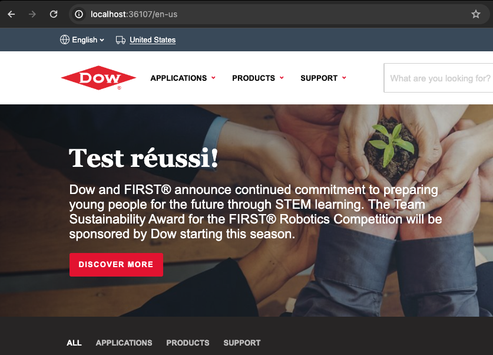

# WeGlot solution-engineer-test


## Installation

```bash
bun install
```

## Deux versions

Il y a deux versions disponibles:
- Une avec seulement Bun (`index.js`)
- Une autre avec Express et http-proxy-middleware (`indexWithModules.js`) pour un cas typique d'utilisation.

### Version Bun

Pour démarrer, exécutez la commande suivante:

```bash
bun start
```

### Version avec modules

Pour démarrer la version avec modules, exécutez la commande suivante:

```bash
bun mod
```

Les deux versions complètent toutes les étapes, y compris la quatrième.


Énoncé du test:

⚠️ **Pas de fork, ni de PR. Utilisez ce repo comme un template sur votre compte par exemple**

## solution-engineer-test

Nous devons aider l'équipe sales pour une démo client, ils utilisent une technologie qui n'est pas courante: [Bun](https://bun.sh/)

Il va falloir l'installer et apprendre à l'utiliser pour intégrer notre solution

Etape 1: créer un proxy qui permet d'afficher le site du client (www.dow.com) *correctement* via le serveur local Bun

Résultat:


Etape 2: créer une version avec `/fr-fr` au lieu de `/en-us` dans l'URL.

Toutes les pages qui commencent normalement par `/en-us/*` seront maintenant aussi accessibles sur `/fr-fr/*`

Etape 3: utiliser `dictionary.json` pour traduire n'importe quel mot sur le site affiché sur la version `/fr-fr/*` seulement

Résultat:



Etape 4: on pourrait naviguer sur `/fr-fr/*` comme sur le site original ?
